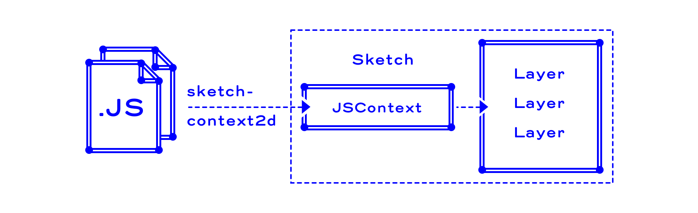

*DRAFT – MORE TO COME* 


##Introduction

This isn't a plugin. Its node.js cmd line tool to run js modules via [browserify](https://github.com/substack/node-browserify) in Sketch.

Essentially it creates a javascript context with an injected canvas object which is a representation of the current selected artboard or group and exposes Sketchs drawing capabilities through the canvas 2d context. The API mirrors CanvasRenderingContext2D.

***Long story short, you can use javascript to draw things in Sketch just like you can in browser environments using canvas.*** 

Paths are shape-layers, text gets translated to text-layers, all still editable and styleable. Transformation, style and text-layout states are saved on a stack.

###Great, but why?

I work on visualising data on a daily basis. With a few exceptions this goes beyond developing simple visually reduced pie- or bar-charts. While there are already solutions for drawing those in Sketch, none of them are flexible enough. They are either too opinionated visually or expect a certain data format.

You shouldnt create visual-systems for data-representation in Sketch, verify them afterwards by implementing a defined style with actual data and hope it won't break. Creating those systems is also about edge-cases: What happens if the actual data isn't as interesting as expected? How can extreme values be handled? In which cases does it make sense to break the rule-set and establish a new one? Those questions should be part of the design process.

We find solutions by constantly switching between design and implementation. I think this process can be unified and happen in a shared environment, right within Sketch and using our own preferred code toolset.  

###Some visual examples


##Usage

###How does it work?


Description here

###Installation
```
//still in dev, atm just run the index.js
```

###File

Example:
```
//you can require node modules 😎
var favModule = require('fav-module');

function main(canvas){ //canvas, your selected artboard / group
    var ctx = canvas.getContext('2d'); //exposed drawing capabilities

    var width  = canvas.width;  //artboard / group width
    var height = canvas.height; //artboard / group height

    ctx.beginPath();     //begin new shape-layer
    ctx.moveTo(0,0);     //construct shape-layer
    ctx.lineTo(100,100);
    ctx.stroke();        //stroke shape-group and add to artboard / group
}

module.exports = main; //expose drawing function to sketch-context2d
```

###Run in Sketch

```
//run sketch-context2d on a module
node index.js --verbose main.js
```

##API-Reference

###CanvasRenderingContext2d References

https://www.w3.org/TR/2dcontext/ 
(best overview)
https://developer.mozilla.org/en/docs/Web/API/CanvasRenderingContext2D  
(more accessible, reference for single cmd tests [here](./test/CanvasRenderingContext2d-API))

###API-Implementation Status

Around 70% is already done, mostly pixel based manipulations is missing. Everything not configurable by Sketch´s Interface is ignored (eg. miterLimit, lineDashOffset).  
[Overview here](./test/CanvasRenderingContext2d-API/SUMMARY.md)

###CanvasRenderingContext2d API Additions

Some additions necessary to the original API:

####Global

```
//check if you are in Sketch
if(sketch){
    //do Sketch specific stuff here
}
```

####Context

```
//Default, text-layers created via fillText/strokeText get transformed 
//to shape-groups to apply all transformations. You can't skew, apply non-uniform
//scales to text-layers
ctx.useTextLayerShapes = true;

//Prevents text-layers from being transformed to shapes. 
//They remain fully editable, scale- and rotation-transforms are ignored though
ctx.useTextLayerShapes = false;
```

####Images

```
var image = new Image();
if(!sketch){
    //you can skip the callback in sketch-context2d, 
    //as images are loaded synchronously
    image.onload = function(){draw(canvas);};
    image.src = pathToImg;
} else {
    image.src = pathToImg;
    draw(canvas);
} 
```
