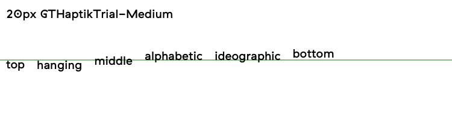

#Summary
-

| Symbol | Description |
|--------|-------------|
| [x] | Implemented
| [o] | Partially implemented |
| [_] | Not implemented |
| [-] | Not supported |

-

| Status | ID | Name | Description |
|--------|----|------|-------------|
| [x]    | 00 | fillRect | - |
| [x]    | 01 | strokeRect | - |
| [o]    | 02 | fillText | if `ctx.useTextLayerShapes = false` only transformation translation works
| [o]    | 03 | strokeText | if `ctx.useTextLayerShapes = false` only transformation translation works, no stroke |
| [x]    | 04 | lineWidth | - |
| [x]    | 05 | lineCap | - |
| [x]    | 06 | lineJoin | - |
| [-]    | 07 | miterLimit | Not supported by Sketch |
| [x]    | 08 | getLineDash | - |
| [x]    | 09 | setLineDash | - |
| [-]    | 10 | lineDashOffset | Not supported by Sketch |
| [x]    | 11 | font | Use Postscript font name |
| [x]    | 12 | textAlign | No support left-to-right / right-to-left locales start / end falls back to just left / right |
| [o]    | 13 | textBaseline | Depends on font information:          
| [x]    | 14 | fillStyle | - |
| [x]    | 15 | strokeStyke | - |
| [x]    | 16 | createLinearGradient | - |
| [o]    | 17 | createRadialGradient | currently only works if outer/inner radius have same origin |
| [_]    | 18 | createPattern | - |
| [x]    | 19 | shadowBlur | - |
| [x]    | 20 | shadowColor | - |
| [x]    | 21 | shadowOffsetX | - |
| [x]    | 22 | shadowOffsetY | - |
| [x]    | 23 | beginPath | - |
| [x]    | 24 | closePath | - |
| [x]    | 25 | moveTo | - |
| [x]    | 26 | lineTo | - |
| [x]    | 27 | bezierCurveTo | - |
| [x]    | 28 | quadraticCurveTo | - |
| [o]    | 29 | arc | problems with anticlockwise full circle, needs investigation |
| [x]    | 30 | arcTo | - |
| [x]    | 31 | rect | - |
| [x]    | 32 | fill | - |
| [x]    | 33 | stroke | - |
| [x]    | 34 | clip | - |
| [x]    | 35 | rotate | - |
| [x]    | 36 | scale | - |
| [x]    | 37 | translate | - |
| [x]    | 38 | transform | - |
| [x]    | 39 | setTransform | - |
| [x]    | 40 | globalAlpha | - |
| [_]    | 41 | globalCompositeOperation | - |
| [_]    | 42 | drawImage | - |
| [_]    | 43 | createImageData | - |
| [_]    | 44 | getImageData | - |
| [_]    | 45 | putImageData | - |
| [o]    | 46 | save | Needs testing if complete stack saved |
| [o]    | 47 | restore | Needs testing if complete stack restored  |
| [x]    | 48 | canvas | - |

